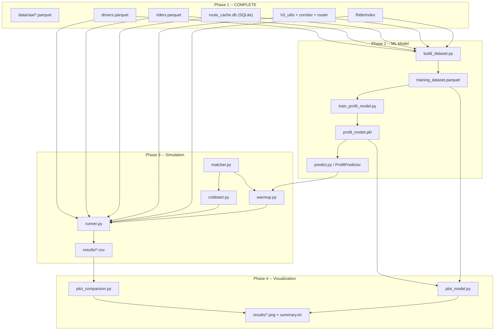

# Complete Build Plan: Warm-Up vs Cold-Start Carpooling Profit Comparison

## What Already Exists (Phase 1 -- DONE)

- **Data on disk**: 4 months of NYC TLC 2015 (Jan-Mar train, Apr test), preprocessed into `data/processed/drivers.parquet` (~1.8M train drivers, >10mi) and `data/processed/riders.parquet` (25% sample, 0.5-10mi)
- **Spatial engine**: [src/spatial/h3_utils.py](src/spatial/h3_utils.py), [src/spatial/corridor.py](src/spatial/corridor.py) -- H3 res-9 cells, corridor building, k-ring expansion
- **OSRM router**: [src/spatial/router.py](src/spatial/router.py) -- `OSRMRouter` with SQLite-backed disk cache, alternatives, waypoint fallback, `cache_only` mode
- **Rider index**: [src/matching/rider_index.py](src/matching/rider_index.py) -- `RiderIndex.find_in_corridor(corridor_cells, hour)` for O(corridor_cells) spatial lookup (vectorized build via pandas groupby)
- **Route cache**: `data/route_cache.db` (SQLite, 39,984 entries for train drivers with 3 alternatives each -- migrated from JSON)
- **OSRM infra**: [osrm/setup_osrm.ps1](osrm/setup_osrm.ps1) for local MLD server via Docker

### Route Cache Migration (completed)

The original `route_cache.json` (1.94 GB) was loaded entirely into memory by the old `RouteCache` class, causing OOM crashes (~4-8 GB heap for 2 GB JSON). The cache was also truncated from a prior crash.

**Resolution:**
1. Migrated JSON → SQLite via streaming `ijson` parser (`scripts/migrate_cache_to_sqlite.py`), recovering 39,984 entries before the truncation point
2. Refactored `RouteCache` to use SQLite key-value store (near-zero memory footprint)
3. Added `cache_only` mode to `OSRMRouter` — cache misses return `[]` instantly instead of making HTTP calls
4. `build_dataset.py` defaults to `--cache-only` mode; pass `--fetch` to enable OSRM API calls

**Sample size decision:** 39,984 cached drivers × 3 routes = ~120K training rows. Research confirms this is more than sufficient for LightGBM with 10 features (NeurIPS 2022 benchmarks show tree models are SOTA on ~10K tabular samples; subsampling to 1% causes <0.5% accuracy drop). The effective independent sample size is ~50-70K due to within-driver route correlation, still well above the sufficiency threshold.

**Driver columns**: `origin_lat, origin_lng, dest_lat, dest_lng, origin_h3, dest_h3, fare_amount, trip_distance_miles, duration_min, hour_of_day, day_of_week, is_weekend, month, split`

**Rider columns**: `pickup_lat, pickup_lng, dropoff_lat, dropoff_lng, pickup_h3, dropoff_h3, fare_amount, trip_distance_miles, duration_min, hour_of_day, day_of_week, is_weekend, month, split`

---

## Phase 2: Profit Prediction ML Model

### 2A -- `src/models/build_dataset.py`

Builds a labeled training dataset: one row per (driver, route) with features and profit label.

**Input**: train-split drivers + train-split riders + SQLite route cache (`data/route_cache.db`)

**Algorithm per driver** (100K sample with seed 42, ~40K have cached routes, rest skipped in cache-only mode):

1. Load driver's origin/dest, fetch 3 routes from `OSRMRouter` (hits cache)
2. For each route, call `build_corridor(route.polyline)` to get the `Corridor`
3. Call `RiderIndex.find_in_corridor(corridor.corridor_cells, driver.hour_of_day)` to get matchable riders
4. Compute label:

```python
PLATFORM_SHARE = 0.50
COST_PER_MILE  = 0.67   # IRS rate

matched_rider_fares = candidates["fare_amount"].values
expected_revenue    = matched_rider_fares.sum() * PLATFORM_SHARE
driver_cost         = route.distance_m / 1609.34 * COST_PER_MILE
expected_profit     = expected_revenue - driver_cost
```

1. Extract feature vector per route:


| Feature                   | Source                                  |
| ------------------------- | --------------------------------------- |
| `route_distance_m`        | `RouteInfo.distance_m`                  |
| `route_duration_s`        | `RouteInfo.duration_s`                  |
| `corridor_cell_count`     | `len(corridor.corridor_cells)`          |
| `hour_of_day`             | driver row                              |
| `day_of_week`             | driver row                              |
| `is_weekend`              | driver row                              |
| `corridor_rider_count`    | len(matched riders)                     |
| `corridor_demand_density` | rider_count / corridor_cell_count       |
| `mean_rider_fare`         | mean of matched rider fares (0 if none) |
| `corridor_fare_density`   | sum(fares) / corridor_cell_count        |


1. Save all rows to `data/ml/training_dataset.parquet`

**Key details**:

- Defaults to `--cache-only` mode: only uses pre-cached routes from SQLite, no OSRM API calls
- Progress logging every 2,000 drivers, incremental checkpoint saves every 5,000 drivers to `training_dataset.partial.parquet`
- Skip drivers where router returns no routes (cache miss in cache-only mode)
- Each driver produces up to 3 rows (one per alternative route)
- Expected output: ~120K rows from ~40K cached drivers

### 2B -- `src/models/train_profit_model.py`

**Train a LightGBM regressor** on the dataset from 2A.

- Target: `expected_profit`
- Features: the 10 features above
- Train on months 1-3 data (already all train-split)
- Hold out a random 20% of training data as validation for hyperparameter selection (this is acceptable since all data is from train months; the real test is month 4 simulation)
- Metrics: RMSE, MAE, R-squared on validation fold
- Save model to `models/profit_model.pkl` via `joblib`
- Save feature importance to `models/feature_importance.csv`
- Print predicted-vs-actual correlation

### 2C -- `src/models/predict.py`

Thin inference wrapper:

```python
class ProfitPredictor:
    def __init__(self, model_path="models/profit_model.pkl"):
        self.model = joblib.load(model_path)

    def predict(self, features: dict) -> float:
        """Predict expected profit for a single route."""

    def rank_routes(self, feature_list: list[dict]) -> list[tuple[int, float]]:
        """Return (route_index, predicted_profit) sorted by profit descending."""
```

---

## Phase 3: Simulation Engine

### 3A -- `src/matching/matcher.py` (Shared Matching Logic)

Two-stage matching used by both cold-start and warm-up:

**Stage 1 -- Spatial filter** (delegates to `RiderIndex`):

- Rider pickup AND dropoff must be in corridor cells
- Rider hour must be within +/-1 hour of driver departure

**Stage 2 -- Feasibility filter** on the candidates from Stage 1:

- `passenger_count <= remaining_seats` (default seats=3)
- Rider pickup comes BEFORE rider dropoff along the route direction (measure by route-cell index: the index of the rider's pickup H3 cell in `corridor.route_cells` must be less than the dropoff cell's index)
- Estimated detour does not exceed `max_detour_minutes` (default 15):

```python
detour_m = haversine_m(rider_pickup, nearest_route_point) + haversine_m(rider_dropoff, nearest_route_point)
detour_min = detour_m / (40_000 / 60)  # 40 km/h urban speed -> meters per minute
```

**Greedy matching**: Sort feasible riders by fare descending (maximize revenue), fill seats until capacity or no more candidates.

**Return**: list of `MatchResult` objects.

### 3B -- `src/simulation/data_types.py`

Dataclasses exactly as specified in the plan:

```python
@dataclass
class DriverTrip:
    driver_id: int
    origin: LatLng
    destination: LatLng
    departure_time: datetime
    hour: int
    seats: int = 3
    max_detour_minutes: float = 15.0
    trip_distance_miles: float = 0.0

@dataclass
class MatchResult:
    driver_id: int
    rider_id: int
    fare_share: float
    detour_minutes: float

@dataclass
class DriverOutcome:
    driver_id: int
    strategy: str           # "warmup" or "coldstart"
    route_distance_miles: float
    matched_riders: int
    total_revenue: float
    driving_cost: float
    profit: float
    route_rank_chosen: int  # 1-3 for warmup, always 1 for coldstart
    predicted_profit: float # ML prediction (warmup only, 0 for coldstart)
    compute_time_s: float
    route_length_category: str  # "short", "medium", "long"
```

### 3C -- `src/simulation/coldstart.py`

Per driver:

1. `router.get_single_route(origin, dest)` -> 1 RouteInfo
2. `build_corridor(route.polyline)` -> Corridor
3. `match_riders(corridor, route, driver, rider_index)` -> matches
4. Compute profit: `sum(match.fare_share) - (distance_miles * 0.67)`
5. Return `DriverOutcome`

### 3D -- `src/simulation/warmup.py`

Per driver:

1. `router.get_alternative_routes(origin, dest, 3)` -> list of RouteInfo
2. For each route: `build_corridor(route.polyline)` -> Corridor
3. Extract features, call `predictor.rank_routes(features)` -> ranked list
4. Select rank-1 route
5. `match_riders(corridor, ranked_route, driver, rider_index)` -> matches
6. Compute actual profit
7. Return `DriverOutcome` (with predicted_profit and route_rank_chosen)

### 3E -- `src/simulation/runner.py` (Experiment Runner)

This is the core orchestrator. Design:

**Route length categories** (based on driver `trip_distance_miles`):

- SHORT: 10-15 miles
- MEDIUM: 15-25 miles
- LONG: 25+ miles

**Experiment flow**:

```
For each seed in [42, 43, 44, 45, 46]:
    Shuffle rider order (affects greedy matching tie-breaking)
    For each test driver:
        Categorize by route length
        Run cold_start_pipeline(driver) -> DriverOutcome
        Run warmup_pipeline(driver)     -> DriverOutcome
        Record both outcomes
```

**Important design decisions**:

- **Paired comparison**: Each driver runs BOTH strategies on the SAME rider pool. This makes it a paired experiment (statistically powerful, controls for driver-level variance).
- **Independent rider pool per driver**: Riders are not "consumed" globally -- each driver independently matches from the full rider set. This avoids fleet-level scheduling complexity and keeps the comparison focused on route-selection strategy.
- **Sample size**: Use ALL test drivers (month 4) or sample ~10K-20K if runtime is prohibitive.

**Output**:

- `results/coldstart_outcomes.csv`
- `results/warmup_outcomes.csv`
- Each row: one driver-seed combination with all DriverOutcome fields
- Also save `results/experiment_config.json` with parameters used

**Batch-route test drivers**: Before simulation, run `OSRMRouter.get_alternative_routes` for all test drivers to pre-populate the SQLite cache. Either extend `batch_route.py` to accept a `--split test` flag, or do it inline in the runner with progress logging. The OSRM server must be running for first pass. Alternatively, run the runner with `cache_only=False` to fetch on-demand (test drivers may differ from train O-D pairs).

---

## Phase 4: Visualization

### 4A -- `visualizations/plot_comparison.py`

All plots read from the CSVs in `results/`. Publication-quality matplotlib/seaborn, saved as PNG + PDF.

**6 core comparison plots**:

1. **Mean profit bar chart with 95% CI** -- cold vs warm-up, overall and per route-length category. Error bars from the 5 seeds. This is the headline result.
2. **Profit distribution box plots** -- per-driver profit distribution for each strategy, faceted by route length category.
3. **Cumulative profit line chart** -- running total profit over N drivers, both strategies overlaid. Shows divergence.
4. **Match rate bar chart** -- % of drivers who matched >=1 rider, by strategy and route length.
5. **Revenue vs cost stacked bar** -- breakdown showing revenue and cost components for each strategy.
6. **Compute time bar chart** -- average wall-clock time per driver (warm-up includes ML inference + 3-route corridor building; cold-start is 1 route + 1 corridor).

### 4B -- `visualizations/plot_model.py`

3 ML insight plots:

1. **Feature importance** -- horizontal bar chart from LightGBM feature_importance.
2. **Predicted vs actual profit scatter** -- with R-squared annotation.
3. **Route rank accuracy** -- when warm-up picks rank-1, how often is it actually the most profitable route? Show as a confusion matrix or accuracy bar.

### 4C -- Statistical summary

Generated by `plot_comparison.py` or a separate function:

- Text table: mean, median, std, min, max profit per strategy per route length
- Paired t-test (or Wilcoxon signed-rank) for statistical significance
- Save to `results/summary.txt`

---

## Phase 5: Polish

### 5A -- `run_all.py`

Single entry point that runs Phases 2-4 in sequence:

```python
# Phase 2
subprocess.run(["python", "src/models/build_dataset.py"])
subprocess.run(["python", "src/models/train_profit_model.py"])
# Phase 3
subprocess.run(["python", "src/simulation/runner.py"])
# Phase 4
subprocess.run(["python", "visualizations/plot_comparison.py"])
subprocess.run(["python", "visualizations/plot_model.py"])
```

Add `--no-api` flag that sets `CARPOOL_NO_API=1` env var, enabling `cache_only` mode on `OSRMRouter` (cache misses return empty routes instead of calling OSRM). For corridors without any cached routes, falls back to straight-line corridors via `build_straight_line_corridor` from [src/spatial/corridor.py](src/spatial/corridor.py).

### 5B -- `README.md`

Setup instructions, dependency install, how to run OSRM server, how to run each phase, expected outputs, project structure.

### 5C -- Minor fixes

- Fix stale docstring in [src/data_prep/preprocess.py](src/data_prep/preprocess.py) line 4: says "resolution 7" but uses resolution 9
- Add `src/data_prep/__init__.py` and `src/simulation/__init__.py` for package consistency

---

## Dependency/Data Flow




---

## Execution Order

1. ~~`scripts/migrate_cache_to_sqlite.py`~~ **(DONE -- 39,984 entries migrated)**
2. `build_dataset.py` (cache-only mode -- ~10-30 min for 100K sample, ~40K cache hits)
3. `train_profit_model.py` (fast -- minutes)
4. Ensure OSRM server running or use `--no-api` / `cache_only`; batch-route test drivers if needed
5. `runner.py` (moderate -- 1-2 hours for 10K test drivers x 2 strategies x 5 seeds)
6. `plot_comparison.py` + `plot_model.py` (seconds)
7. `run_all.py` + `README.md`

### Infrastructure changes applied
- `RouteCache` in `router.py`: JSON → SQLite (WAL mode, near-zero RAM)
- `OSRMRouter`: added `cache_only` parameter + `CARPOOL_NO_API` env var support
- `RiderIndex._build()`: Python for-loop → pandas `groupby` (~5-10x faster)
- `build_dataset.py`: `--cache-only` default, `--fetch` to enable API, incremental checkpoints
- All `CACHE_PATH` references updated: `.json` → `.db` in `build_dataset.py`, `batch_route.py`, `runner.py`
- `requirements.txt`: added `ijson>=3.2`

