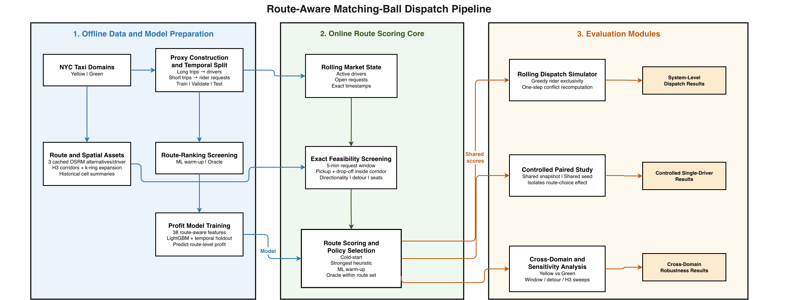
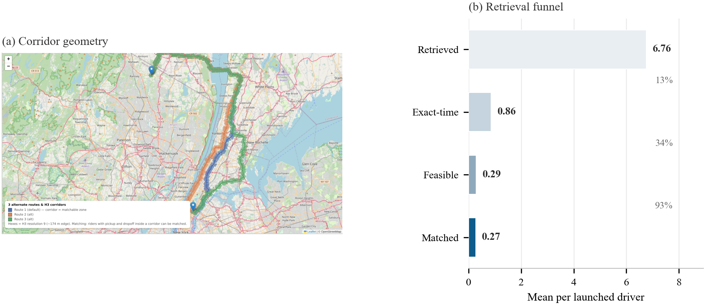
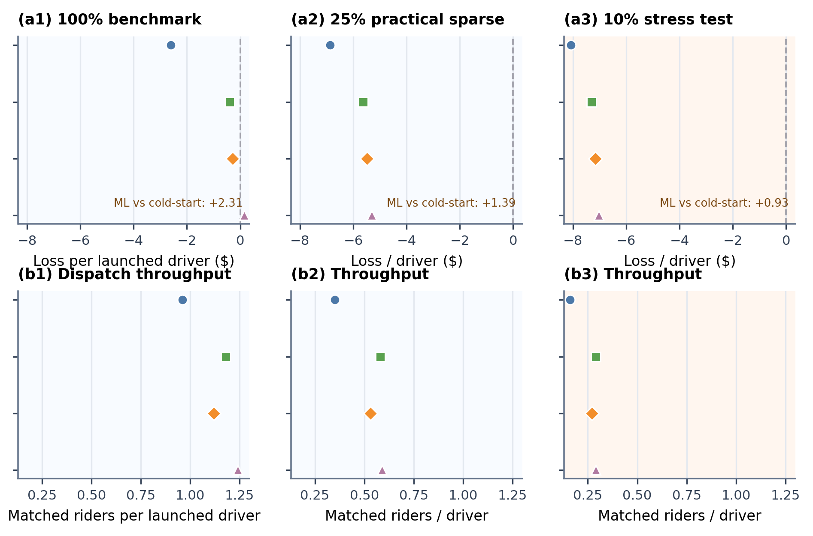
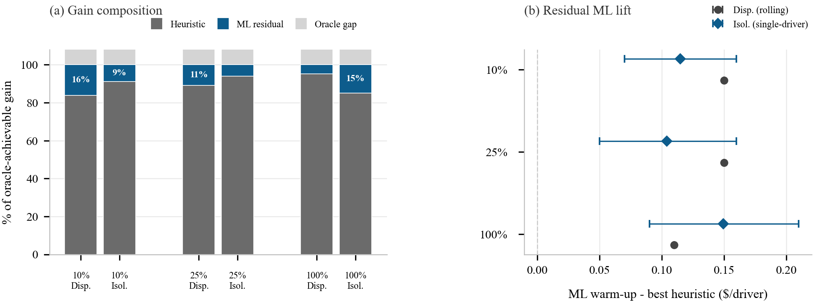
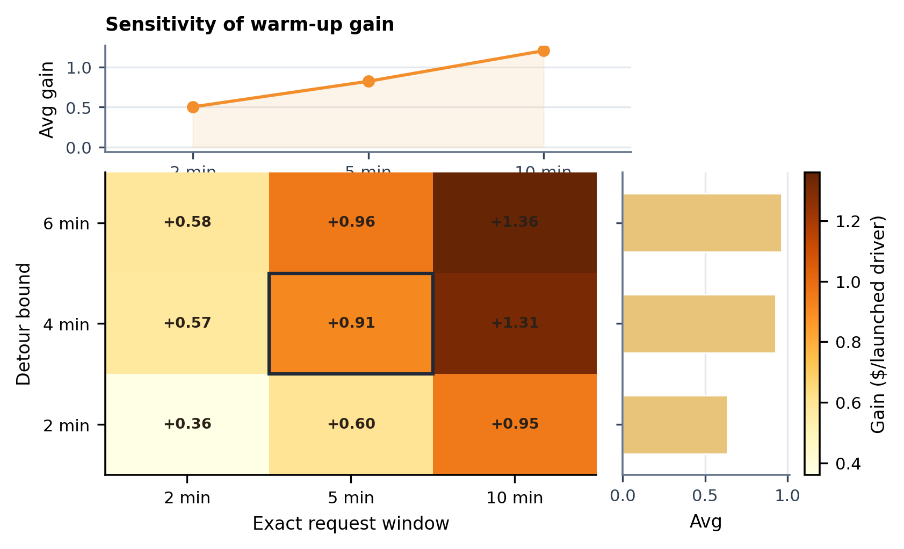

# Does Route Choice Matter in Ride-Pooling Dispatch?

This repository contains the public release for our study of route-aware ride-pooling on public NYC taxi data. The codebase includes the matching-ball retrieval engine, route-ranking models, rolling-horizon dispatch workflow, generated result tables, publication figures, and the manuscript package used for submission.

The core question is simple:

> If a platform evaluates a small set of genuine road-network alternatives before committing a driver to a route, does route choice materially change which riders are realistically matchable and what dispatch outcome the platform achieves?

<p align="center">
  
</p>

## Why This Repository Exists

Most route-selection pipelines treat the default route as fixed and study matching only after that choice has already been made. This repository studies a narrower but operationally important question:

- alternative feasible routes expose the platform to different rider pools
- route value should depend on exact-time feasible matching, not corridor exposure alone
- route-selection gains should still be tested inside shared rolling dispatch, not only in isolated route scoring

The repository therefore separates:

- route-aware candidate construction through H3 corridors
- exact eligibility through true request-window filtering
- route scoring through heuristics and learned predictors
- system-level validation through rolling 60-second dispatch batches with rider exclusivity

## Main Findings

The headline public-facing results in the submission snapshot are:

| Setting | Cold-start | Best heuristic | ML warm-up | Oracle |
|---|---:|---:|---:|---:|
| Yellow primary dispatch loss / driver | `$8.08` | `$7.30` | `$7.15` | `$7.02` |
| Green primary dispatch loss / driver | `$7.66` | `$7.54` | `$7.27` | `$7.25` |
| Yellow isolated 10% single-driver loss | `$7.40` | `$6.28` | `$6.17` | `$5.95` |

What this means in practice:

- route-aware dispatch clearly improves on default cold-start routing
- most of the recoverable gain is already captured by strong non-ML heuristics
- the learned scorer retains a smaller but consistent residual edge
- exact request-window assumptions materially change the result and should not be conflated with coarse retrieval bins

## Visual Overview

<p align="center">
  
  
</p>

<p align="center">
  
  
</p>

These figures illustrate four parts of the story:

- concept: route choice changes candidate exposure before assignment even begins
- mechanism: retrieved corridor candidates shrink sharply once exact-time and feasibility checks are enforced
- system-level impact: route-aware policies still matter in rolling dispatch
- interpretation: most of the gain comes from route-aware retrieval and strong heuristics, with ML adding a smaller residual lift

## Repository Layout

- `src/`: matching, routing, simulation, dispatch, and model-training code
- `scripts/`: artifact runners, validators, summarizers, and analysis utilities
- `visualizations/`: plotting scripts for publication-facing figures
- `results/`: checked-in summary tables and publication figures
- `paper/`: standalone IEEE-style manuscript package
- `tests/`: artifact and regression sanity checks
- `osrm/`: local OSRM setup helpers

Large raw and processed data products are intentionally not tracked in the public repository snapshot.

## Data Sources

The public release is built around openly available trip records and open routing/spatial tools:

- NYC TLC Yellow Taxi trip data
- NYC TLC Green Taxi trip data
- OSRM route alternatives
- H3 spatial indexing

The proxy design uses long taxi trips as driver surrogates and shorter trips as rider requests. Reported values are scenario-profit outputs under fixed assumptions rather than calibrated platform margins.

## Quick Start

Install dependencies:

```powershell
python -m pip install -r requirements.txt
```

Run the full artifact:

```powershell
python run_all.py
```

Useful entry points:

```powershell
python run_all.py --single-driver-only
python run_all.py --dispatch-only --sample 1000 --seeds 3
python scripts\run_dispatch_artifact.py --sample 1000 --seeds 3 --primary-only
python visualizations\plot_paper_figures.py
python scripts\validate_paper_consistency.py
```

## Reproducibility

The reproducibility guide lives in [REPRODUCIBILITY.md](REPRODUCIBILITY.md).

Key checked-in outputs include:

- `results/dispatch_yellow_primary.csv`
- `results/dispatch_green_primary.csv`
- `results/domain_transfer_summary.csv`
- `results/dispatch_density_summary.csv`
- `results/dispatch_window_sensitivity.csv`
- `results/dispatch_detour_sensitivity.csv`
- `results/paper_primary_summary.csv`
- `results/model_comparison.csv`
- `results/strategy_gap_results.csv`
- `results/plots/paper_fig*.png`

## Manuscript Package

The paper source is in:

- `paper/ieee_submission.tex`
- `paper/references.bib`
- `paper/figures/`

The paper package notes are in [paper/README.md](paper/README.md).

## Citation

If you use this repository, please cite the project metadata in [CITATION.cff](CITATION.cff) and reference the accompanying manuscript package under `paper/`.

## License

This repository is released under the [MIT License](LICENSE).
